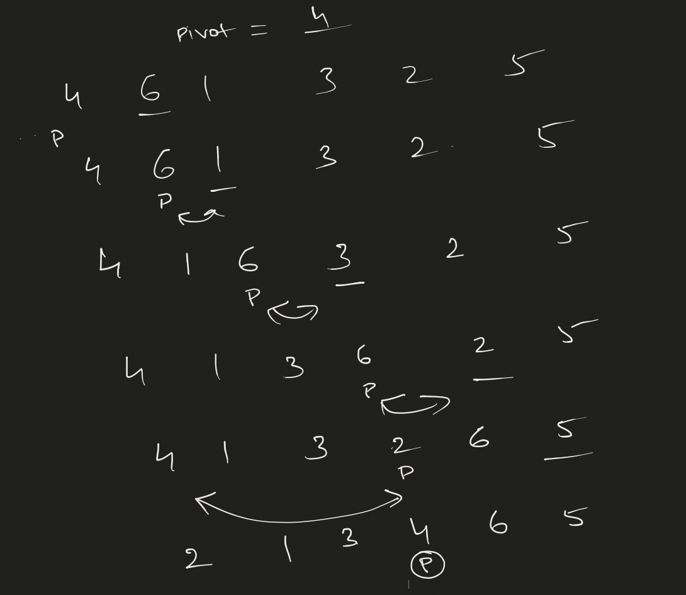
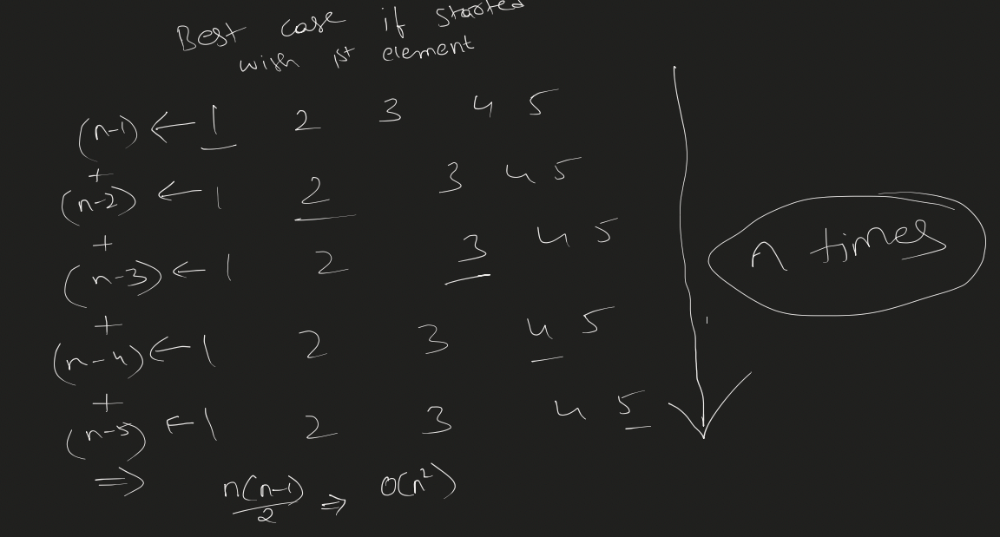
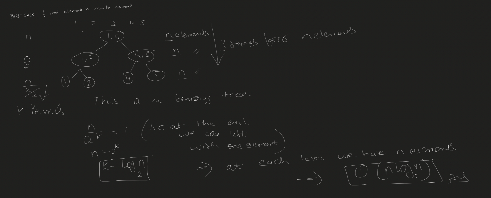

### Example of how the `find_pivot_and_partition` function works

Idea is to find the possible pivot index of the element and perform the partition

Now coming to Time Complexities:

### Best Case if started with the 1st element as pivot index

With this, even the best case scenario becomes the worst case scenario

- Just that the swaps are minimal but searching is still happening

### Best case if started with the middle element as pivot index

### Suggestions for Quick sort

- Select middle element as pivot
- Select random element as pivot

### Now Space Complexity

- Since this is a recursive algo, it will not need extra space, but it will use a stack
- Stack Size would be
    - Best case
        - O(N)
    - Worst case
        - O(log(N))
