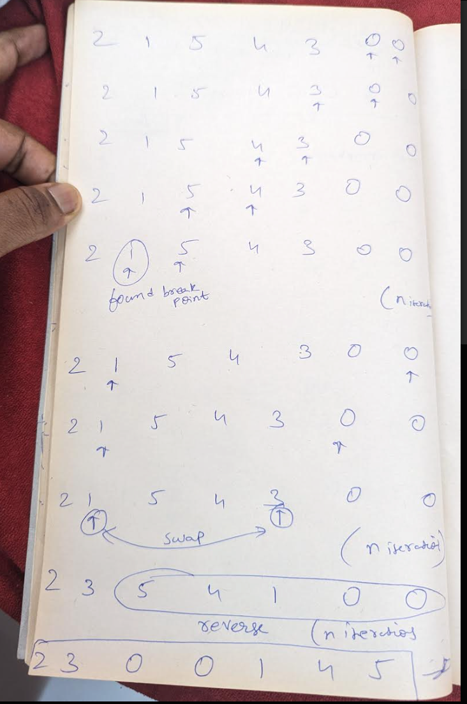

Example 1 :

Input format:
Arr[] = {1,3,2}
Output
: Arr[] = {2,1,3}
Explanation:
All permutations of {1,2,3} are {{1,2,3} , {1,3,2}, {2,13} , {2,3,1} , {3,1,2} , {3,2,1}}. So, the next permutation just
after {1,3,2} is {2,1,3}.
Example 2:

Input format:
Arr[] = {3,2,1}
Output:
Arr[] = {1,2,3}
Explanation:
As we see all permutations of {1,2,3}, we find {3,2,1} at the last position. So, we have to return the topmost
permutation.

Algorithm:

1. 1st find the breakpoint by getting least value in right part of sub array
2. Coming from the right, now find a value that is greater than the above value
3. Swap them
4. Reverse the right part of the sub array
   