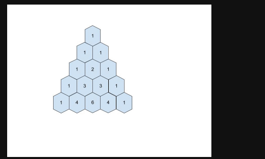

Program to generate Pascal's Triangle

Problem Statement: This problem has 3 variations. They are stated below:

Variation 1: Given row number r and column number c. Print the element at position (r, c) in Pascal’s triangle.

Variation 2: Given the row number n. Print the n-th row of Pascal’s triangle.

Variation 3: Given the number of rows n. Print the first n rows of Pascal’s triangle.

In Pascal’s triangle, each number is the sum of the two numbers directly above it as shown in the figure below:

Algorithm for Variation 1:

- This is if first row is 0 and first col is 0
- rCc
    - (r - no . of rows, c- no. of columns)

- if first row is 1 and first col is 1
- (r-1)C(c-1)
    - (r - no . of rows, c- no. of columns)