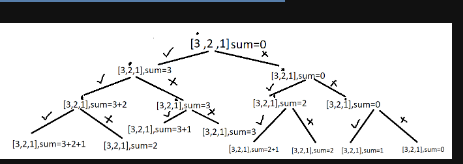
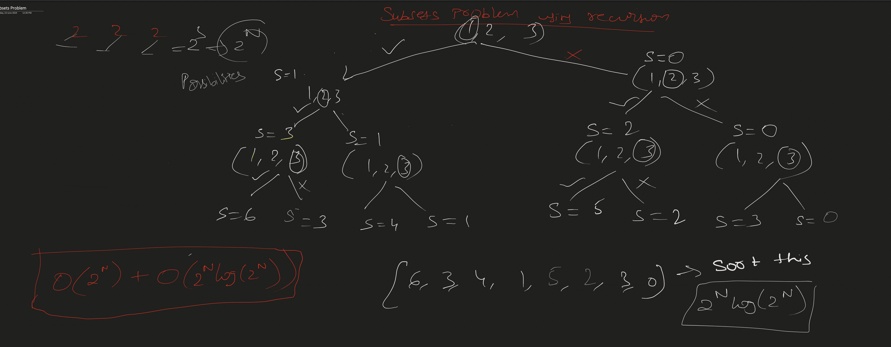

Problem Statement: Given an array print all the sum of the subset generated from it, in the increasing order.

Examples:

Example 1:

Input: N = 3, arr[] = {5,2,1}

Output: 0,1,2,3,5,6,7,8

Explanation: We have to find all the subset’s sum and print them.in this case the generated subsets
are [ [], [1], [2], [2,1], [5], [5,1], [5,2]. [5,2,1],so the sums we get will be 0,1,2,3,5,6,7,8

Input: N=3,arr[]= {3,1,2}

Output: 0,1,2,3,3,4,5,6

Explanation: We have to find all the subset’s sum and print them.in this case the generated subsets
are [ [], [1], [2], [2,1], [3], [3,1], [3,2]. [3,2,1],so the sums we get will be 0,1,2,3,3,4,5,6

Solution
Disclaimer: Don't jump directly to the solution, try it out yourself first.

Solution 1: Using recursion

Intuition: The main idea is that on every index you have two options either to select the element to add it to your
subset(pick) or not select the element at that index and move to the next index(non-pick).

Approach: Traverse through the array and for each index solve for two arrays, one where you pick the element,i.e add the
element to the sum or don’t pick and move to the next element, recursively, until the base condition. Here when you
reach the end of the array is the base condition.

