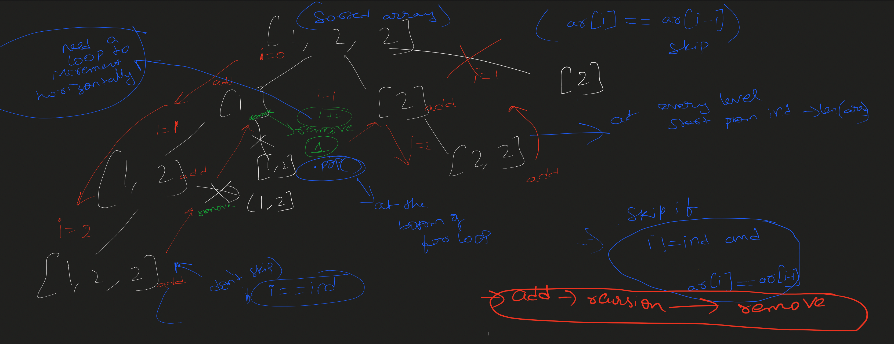

https://takeuforward.org/data-structure/subset-ii-print-all-the-unique-subsets/
Subset - II | Print all the Unique Subsets

27

0
Problem Statement: Given an array of integers that may contain duplicates the task is to return all possible subsets.
Return only unique subsets and they can be in any order.

Examples:

Example 1:

Input: array[] = [1,2,2]

Output: [ [ ],[1],[1,2],[1,2,2],[2],[2,2] ]

Explanation: We can have subsets ranging from length 0 to 3. which are listed above. Also the subset [1,2] appears twice
but is printed only once as we require only unique subsets.

Input: array[] = [1]

Output: [ [ ], [1] ]

Explanation: Only two unique subsets are available

