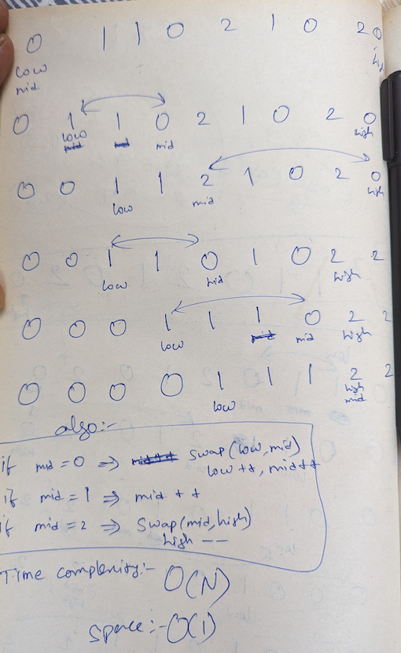

## Count Approach

Time Complexity is:
2*O(N)

- First iteration to count the elements
- Second iteration to put the values in its places

Space Complexity:
O(1)

- As we did not use any extra structure to store the data, its just single variables

## Optimal Approach

Also called Dutch National Flag algo

Below are the rules to be used

```
[0 ... low-1] -> 0
[low ... mid-1] -> 1
[high+1 ... n-1] -> 2
```

algo

```
if mid==0 =>  swap(low, mid); low++; mid++;
if mid==1 =>  mid++;
if mid==2 =>  swap(mid,high); high--;
```

Illustration below:

